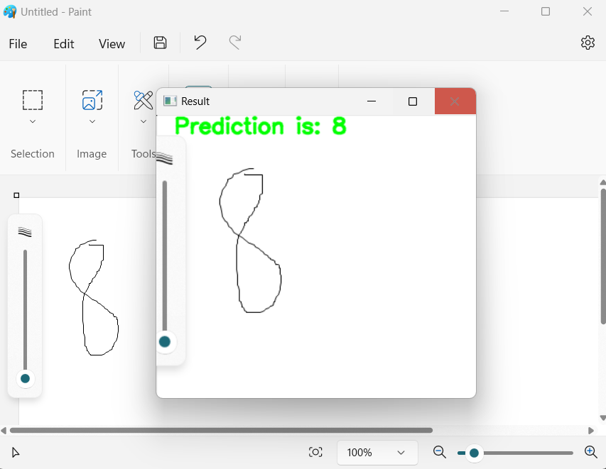

# Handwritten Digit Recognition


## Overview

This project is a Handwritten Digit Recognition system that uses the OpenCV library and a Support Vector Classifier (SVC) to recognize digits drawn by the user. The model achieves an accuracy of 92.5%.

## Table of Contents

- [Overview](#overview)
- [Features](#features)
- [Installation](#installation)
- [Usage](#usage)
- [Demo](#demo)
- [Contributing](#contributing)
- [License](#license)

## Features

- Real-time digit recognition using OpenCV and SVC
- High accuracy of 92.5%
- Easy-to-use interface for drawing digits
- Automatic prediction display every 8 seconds

## Installation

To get started with this project, follow these steps:

1. **Clone the repository:**

   ```bash
   git clone https://github.com/yourusername/HandwrittenDigitRecognition.git
   cd HandwrittenDigitRecognition

   ```

2. **Create a virtual environment:**
   python -m venv venv
   source venv/bin/activate # On Windows use `venv\Scripts\activate`

## Usage

### To use the Handwritten Digit Recognition system, follow these steps:

1. **Open the paint window in the top left corner of your screen.**
2. **Run the code:**

   bash
   python app.py

3. **Draw any digit from 0 to 9 in the paint window.**
4. **A prediction window will open showing the results.**
5. **The prediction will update every 8 seconds until you interrupt the code.**

## DEMO

Here is a demo result of the digit recognition:



## Acknowledgements

    OpenCV
    scikit-learn
    pyscreenshot
    joblib
